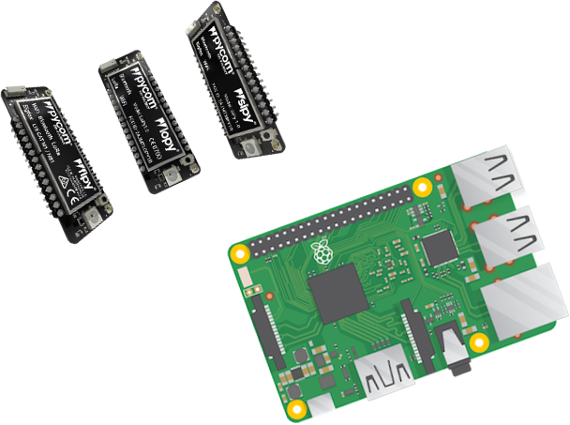

# Resin OTA Manager for Pycom Devices


This directory contains a example implementation of over the air (OTA)
firmware updates. This consists of two components:
  - A server that serves the update files and generates update "manifests"
  - A library that allows a Pycom module perform updates from the server

This directory is laid out such that the update sever can directly run from it.
For a detailed description of how the server expect the directory to be structured please read the comment at the top of `OTA_server.py`.

<p align="center">

</p>

Installation
-----

Begin by cloning this repo to your local environment using the following command:

```
$ git clone https://github.com/bucknalla/resin-pycom-ota.git
```

# OTA Server

Setup
-----
The Pycom OTA Server will run a HTTP server on port 8000 (this can be changed in the [OTA_server.py](OTA_server.py) file). The OTA server allows for both firmware (FW) and software (SW) updates to Pycom devices.

Within this repository, there are two directories labelled `1.0.0` and `1.0.1`. These are both working examples of the OTA procedure, the only difference being the colour of the on-board LED so that a successful update can be demonstrated (Blue for `1.0.0` and green for `1.0.1`). You should upload version `1.0.0` to the module first and then via the OTA update procedure it will update to version `1.0.1`. The `pymakr.conf` associated with this project is included for ease of identifying which directory to upload. For more information, see the Pycom Libraries [OTA Example](https://github.com/pycom/pycom-libraries/tree/master/examples/OTA). Additional versions of SW may be placed into the [Pycom](Pycom/) folder, following the same versioning scheme.

You will also need to set up device/fleet variables [config.py](config.py) to add your WiFi SSID, password and the address of the update server. Ensure you make these changes in both `1.0.0` and `1.0.1` or the code will stop working after the OTA update.

**It is essential that you test the SW and FW before deploying to a device in the field as there is no way to recover a device failure, unless you have included such fault tolerance.**

Additionally, if you wish to use the OTA server to update the firmware of a Pycom device, place the firmware.bin file into the [Pycom](Pycom/) directory.

# Pycom Device

Setup
-----
To write your own Pycom device code, navigate to the [Pycom/1.0.0/flash](Pycom/1.0.0/flash/) directory and modify the [Pycom/1.0.0/flash/main.py](Pycom/1.0.0/flash/main.py) file. Ensure to retain the OTA library and the config.py files.

To upload your own programs to the Pycom device, copy the [Pycom/1.0.0/flash](Pycom/1.0.0/flash/) directory onto the Pycom device either via USB or FTP upload.

# Resin OTA Manager

Setup
-----

To setup a resin device (i.e. RPI3) with OTA Manager, provision a resin device following their [getting started](https://docs.resin.io/learn/getting-started/raspberrypi3/python/) guide. Once you have reached the point of [deploying code](https://docs.resin.io/learn/getting-started/raspberrypi3/python/#deploy-code), follow the steps below:

Ensure that you are in the repository & add your resin remote
```
$ cd resin-pycom-ota
$ git remote add resin <USERNAME>@git.resin.io:<USERNAME>/<APPNAME>.git
```
*This can be found in your resin Application dashboard in the top right corner.*

Next push your local repo up to the remote
```
$ git push resin master
```

This will then build the container image and start the server running on your device. You will still need to specify settings for your server and Pycom devices.

User Settings
-----

In order to specify settings such as `WIFI_SSID` and `WIFI_PASS`, you will need to navigate to the `device service variable` settings tab. Here create variables for the following options:

```
WIFI_SSID = "your-wifi-ssid"
WIFI_PW = "your-wifi-password"
SERVER_IP = "your-server-ip"
SERVER_PORT =  "your-server-port"
```

# Future Features

- [x] Allow for Device Variable Configuration
- [ ] Allow eligible devices to open Access Points for Pycom Devices
- [ ] Provide example for fault tolerant software (i.e. restore to previous firmware)
- [ ] Provide automatic firmware retrieval from Pycom servers
